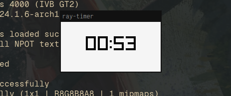

# Simple timer in Raylib and Go

Use arrow keys or h, j, k, l to adjust the time.



```sh 
git clone https://github.com/mustardfrog/ray-timer.git
cd ray-timer
# make sure $GOPATH environment variable is set
go install .
```
